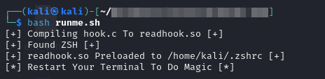
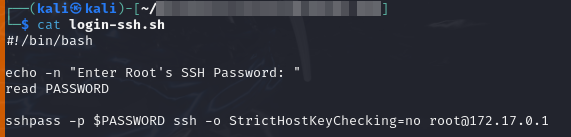
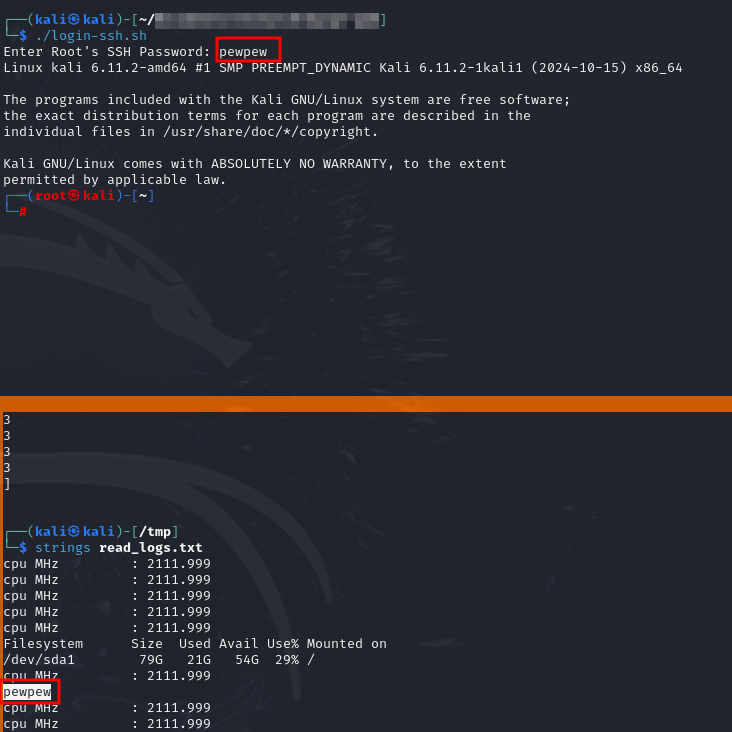

# hook-read-function
Malicious shared library that will hook into the `read` function within bash and logs the inputs after it's preloaded with **LD_PRELOAD**.

**❗ Usage of this program under an unauthorized context is strictly forbidden. The author(s) of read-func-hook do not take any responsibility for any harm caused to systems. Use with caution. ❗**

## Description
Basically by intercepting the calls to the `read` function made by any script/program we could easily execute our own code as well allowing us to log whatever input is inserted and passed into the `read` function.

## POC
> Tested on Kali 2024.4 (Debian)

Run the script `runme.sh` to compile the C file, and also export LD_PRELOAD with the value as the shared-library just compiled into shell profile.

```shell
chmod +x runme.sh
./runme.sh
```
This is how it should look like after running it:



### Use Case
Assuming you are in a pentest engagement, and in the server you compromised there is a script named `login-ssh.sh` which a legit user would use to login in as root via SSH. The script would basically take in the password using the `read` function for the root password before attempting to use it to login, Here is how the script `login-ssh.sh` would look like:



Basically you would run the `runme.sh` script which would then preload the shared library to the user's profile, and then wait for the user to attempt run the script. Once the script is run and the password is insterted, then the input should be logged in `/tmp/read_logs.txt`.

You can fetch the inputs by simply running the command:
```shell
strings /tmp/read_logs.txt
```



